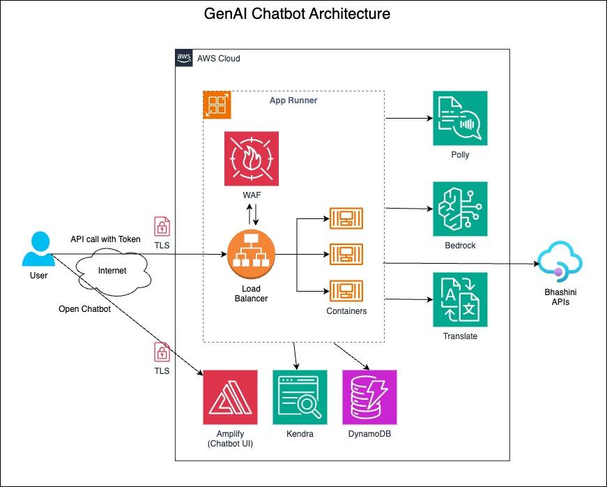

For detailed instructions, please refer to this Implementation guide: https://www.cloudevangelist.in/2024/09/implementation-guide-for-genai-bedrock.html

# Setup Instructions for genai-bedrock-voicebot

This guide will walk you through the steps to set up the `genai-bedrock-voicebot` projects using AWS Amplify and App Runner.

## Architecture
 

## Table of Contents
1. [Fork the Repository](#1-fork-the-repository)
2. [Login to AWS](#2-login-to-aws)
3. [Create a GitHub Connection in AWS App Runner](#3-create-a-github-connection-in-aws-app-runner)
4. [Create the Admin Console Amplify App](#4-create-the-admin-console-amplify-app)
    - [Configure Environment Variables](#configure-environment-variables-admin-console)
    - [Modify Project Name](#modify-project-name-admin-console)
5. [Retrieve API Endpoints](#5-retrieve-api-endpoints)
6. [Create the Chat UI Amplify App](#6-create-the-chat-ui-amplify-app)
    - [Configure Environment Variables](#configure-environment-variables-chat-ui)
    - [Modify Project Name](#modify-project-name-chat-ui)
7. [Update Environment Variable in Admin Console](#7-update-environment-variable-in-admin-console)

## 1. Fork the Repository

1. Navigate to the repository: [genai-bedrock-voicebot](https://github.com/tiwarivikas/genai-bedrock-voicebot).
2. Click on the **Fork** button at the top right corner.
3. Select your GitHub account to create the fork.
4. Once forked, note down your fork's URL (e.g., `https://github.com/<YourGitHubUsername>/genai-bedrock-voicebot`).

## 2. Login to AWS

1. Open the [AWS Management Console](https://aws.amazon.com/console/).
2. Enter your AWS account credentials to log in.

## 2.1. Enable Bedrock "Mixtral 8x7B Instruct" LLM Model Access
1. Navigate to the Amazon Bedrock service by searching for "Bedrock" in the AWS console search bar
2. In the Amazon Bedrock console, go to the "Model access" section from the left navigation pane
3. Click on "Manage model access."
Locate the "Mixtral 8x7B Instruct" model under the Mistral AI provider
4. Select the checkbox next to the model to request access.
5. Review and agree to the End User License Agreement (EULA) if prompted.
6. Click "Save changes" to submit your access request. Access should be granted shortly after

## 3. Create a GitHub Connection in AWS App Runner

1. In the AWS Console, search for **App Runner** and open the App Runner console.
2. Click on **Connections** in the left-hand menu.
3. Click **Create connection**.
4. Follow the instructions to authenticate your GitHub account and create the connection.
5. Copy the ARN of the newly created GitHub connection.

## 4. Create the Admin Console Amplify App

1. Open the AWS Amplify console by searching for **Amplify** in the AWS Console.
2. Click **New App** > **Host web app**.
3. Select **GitHub** as the repository provider and connect your GitHub account.
4. Choose your forked repository and select the branch you want to use (default: `main`).
5. Enable **Monorepo** and set the "Monorepo root Directory" to `amplify-chat-admin`.
6. Click **Next**.

### Configure Environment Variables (Admin Console)

In the **Advanced settings** section, add the following environment variables:

- `JWT_SECRET='<Specify a random string>'`
- `APPRUNNER_GITHUB_URL='<Your GitHub Fork URL>'`
- `APPRUNNER_GITHUB_BRANCH_MAIN='<Your GitHub Fork Branch Name>'` (Default is `main`)
- `APPRUNNER_GITHUB_CONNECTION_ARN='<ARN of GitHub Connection from App Runner>'`
- `CHAT_PROD_API=""` (Leave this blank initially)
- `BHASHINI_USER_ID="<User ID of Bhashini>"` (Optional)
- `BHASHINI_API_KEY="<API Key of Bhashini>"` (Optional)
- `KENDRA_INDEXID=""` (Optional. If specified, project will use existing Kendra instead creating a new one)

### Modify Project Name (Admin Console)

1. On the next screen, modify the project name to something like `genai-bedrock-voicebot-admin`.
2. Click **Save and Deploy**.

## 5. Retrieve API Endpoints

1. Wait for the deployment to complete.
2. Download the `amplify_outputs.json` file from the Amplify console.
3. Locate the following variables in the last two lines of the file:
   - `VITE_APIGW_ENDPOINT: <HTTP API Gateway URL>`
   - `VITE_STREAMING_API_ENDPOINT: <App Runner URL>`
4. Note down these values for later use.

## 6. Create the Chat UI Amplify App

1. In the Amplify console, click **New App** > **Host web app**.
2. Select your forked repository and branch.
3. Set the "Monorepo root Directory" to `amplify-chat-ui`.
4. Click **Next**.

### Configure Environment Variables (Chat UI)

In the **Advanced settings** section, add the following environment variables:

- `VITE_APIGW_ENDPOINT='<HTTP API Gateway URL>'` (from the previous step)
- `VITE_STREAMING_API_ENDPOINT='<App Runner URL>'` (from the previous step)

### Modify Project Name (Chat UI)

1. Modify the project name to something like `genai-bedrock-voicebot-chat-ui`.
2. Click **Save and Deploy**.

## 7. Update Environment Variable in Admin Console

1. After deploying the Chat UI, copy the Amplify URL for the Chat UI deployment.
2. Return to the Amplify console for the Admin Console project (`genai-bedrock-voicebot-admin`).
3. Navigate to **Environment Variables**.
4. Update the `CHAT_PROD_API` environment variable with the URL of the Chat UI Amplify project.
5. Redeploy the Admin Console application to apply the changes.

---

This guide should help you set up both the Admin Console and Chat UI projects in AWS Amplify, with all necessary configurations and environment variables in place.

---

## Testing the Deployed Application

To test the application, follow these steps:

1. **Open the Amplify Admin Application URL:**  
   Navigate to the URL provided by the Amplify Admin Console deployment.

2. **Cognito Authentication:**  
   The application will prompt you for authentication using Amazon Cognito. Create an account using your email ID.  
   - After signing up, check your email for a verification link.
   - Complete the email verification and log in to the console.

3. **Create a New Chatbot:**
   - Once logged in, create a new chatbot by providing the **Customer Name**, **Website**, and **Chatbot Name**.
   - Submit the form to generate the chatbot.

4. **Access the Chatbot:**
   - The newly created chatbot will appear in the list. Click on the chatbot name link to open it in a new tab.
   - Validate that the chatbot name and details match what you provided earlier.

5. **Test Basic Functionality:**
   - In the chatbot interface, try sending a "Hello" message and confirm that you receive a proper response.

6. **Validate Website Crawling:**
   - Wait for approximately 30 minutes to allow the backend engine to crawl the specified website.
   - Afterward, try asking a question related to the website content to experience the capabilities of the GenAI chatbot powered by Amazon Bedrock.

7. **Test Voice Bot Functionality:**
   - Click on the microphone button to test the voice bot functionality.
   - The bot supports voice input in English and Hindi (powered by Amazon Polly) and other Indian local languages if Bhashini is configured.
   - If you have entered your Bhashini User ID and API Key, the bot will also respond in regional Indian languages.

8. **Integrate Chatbot into a Website:**
   - For demo purposes, the chatbot can be integrated into any website via a TamperMonkey script.
   - For production deployment, you can embed the chatbot directly into the website using a simple 4-line script.

---
